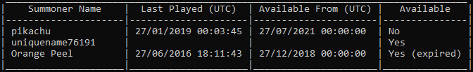

<h1 align="center">League of Legends Summoner Name Checker</h1>

> .NET Library and Console Utility for checking the availability of Summoner names for League of Legends

<h2>Features</h2>

- Check the availability of Summoner names in bulk on any game server
- If a name is unavailable, see when the account was last played on and when the name will become available
- Display results in a table
- Export results to CSV

  

<h2>Usage</h2>

1. Download the latest `league-summoner-name-checker-x.x.x.zip` (where x.x.x is the version number) on the [Releases](https://github.com/GeorgeGee/league-summoner-name-checker/releases) page and extract the contents into a folder
2. Create a text file `names.txt` inside the same folder, containing summoner names to check availability for (line separated)
3. Open PowerShell or Command Prompt and change directory to the folder which contains the downloaded files
4. Run the following command:  
`.\SummonerNameCheckerConsole.exe --apikey "API_KEY" --input "names.txt" --server "euw1"`
> Replace `API_KEY` with your Riot Games API key. Get one for free at the [Riot Developer Portal](https://developer.riotgames.com).

<h2>Arguments</h2>

<h4>Console Utility arguments</h3>

Name|Type|Description
-|-|-
`-a` or `--apikey`|String|**Required.** Riot Games API key. Get one for free at https://developer.riotgames.com 
`-i` or `--input`|String|**Required.** Input `.txt` file path for names to check, line-separated
`-o` or `--output`|String|*Optional.* Output `.csv` file path for saving results to CSV
`-s` or `--server`|String|*Optional.* League of Legends game server code (see table below). Default is `euw1` (EU West)
`--sortby`|String|*Optional.* Sort the results in the table and/or CSV by a value. Options are `none` (default), `name`, `lastplayed`, `availablefrom`, and `available`
`--sortorder`|String|*Optional.* Sorting order, to be used in conjunction with `--sortby`. Options are `asc` for ascending (default) and `desc` for descending

<h4>Server codes</h3>

Server|Code
-|-
Europe West|`euw1`
Europe Nordic & East|`eun1`
North America|`na1`
Latin America North|`la1`
Latin America South|`la2`
Brazil|`br1`
Japan|`jp1`
Russia|`ru`
Turkey|`tr1`
Oceania|`oc1`
Republic of Korea|`kr`

<h2>Notes</h2>

- Both the Library and Console Utility target .NET 5.0.
- The Library will respect the [API Rate Limits](https://developer.riotgames.com/rate-limiting.html) by waiting the recommended time period before retrying requests.

<h2>Disclaimer</h2>

> League of Legends Summoner Name Checker isn't endorsed by Riot Games and doesn't reflect the views or opinions of Riot Games or anyone officially involved in producing or managing League of Legends. League of Legends and Riot Games are trademarks or registered trademarks of Riot Games, Inc. League of Legends © Riot Games, Inc.